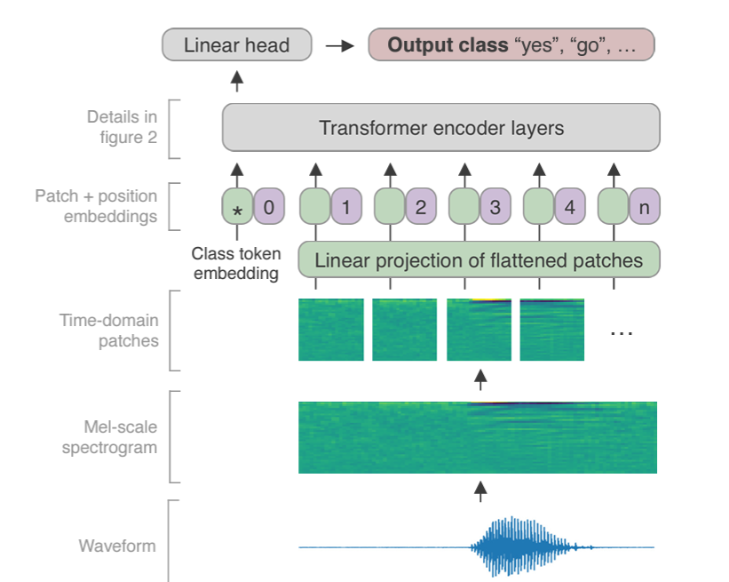
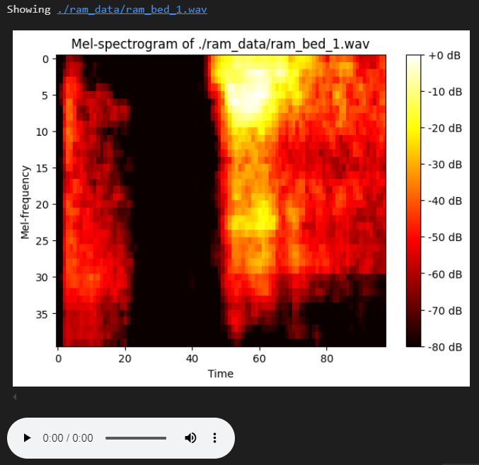
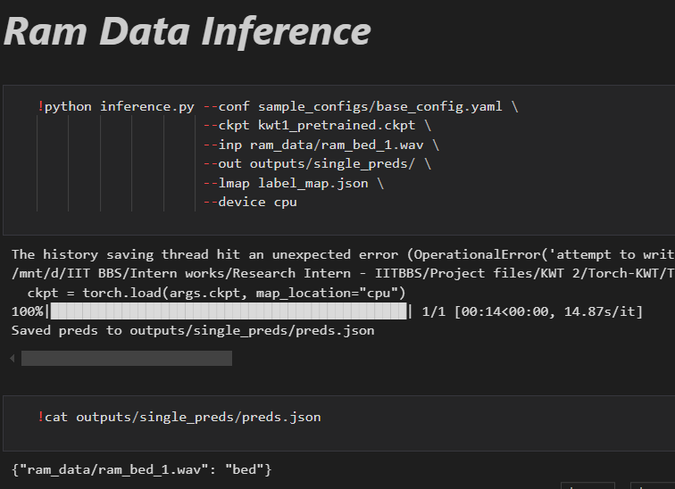

# **Keyword Transformer Model - ASR-Free Keyword Spotting**
PyTorch implementation of the paper, [*Keyword Transformer: A Self-Attention Model for Keyword Spotting*](https://arxiv.org/abs/2104.00769). </br>
Made in **Linux OS (WSL)**

---

## Transformer Model
The **Keyword Transformer (KWT)** is a state-of-the-art model designed specifically for keyword spotting. This model leverages the capabilities of the Transformer architecture to effectively detect specific words in audio streams.

### Key Features

- **High Performance**: KWT achieves impressive accuracy, setting new benchmarks on the Google Speech Commands dataset with 98.6% accuracy for the 12-command task and 97.7% for the 35-command task.
- **Fully Self-Attentional**: Unlike other models that combine various techniques, KWT operates entirely on self-attention mechanisms, simplifying the architecture.
- **Flexibility**: The model can easily replace more complex models, providing a simpler yet effective solution for keyword spotting tasks.

### Architecture Overview
- Audio input is processed into a mel-scale spectrogram, which is then divided into non-overlapping patches.
- A learned class token is combined with the input patches to create input tokens for the Transformer encoder.
- The model uses multi-head attention and feed-forward layers to process these tokens.
- It features a design that can be adjusted based on the desired model size and performance.

### Knowledge Distillation
- KWT incorporates knowledge distillation, using predictions from a pre-trained model to enhance training, improving overall performance.

### Architecture


*The Keyword Transformer architecture diagram.*

---


## Setup

```bash
git clone https://github.com/RamakrishnaReddyPalle/Keyword-Transformer-Model-ASR-Free-KWS.git
```
```bash
cd path\to\cloned\folder
```
```bash
pip install -r requirements.txt
```

## Dataset
To download the Google Speech Commands V2 dataset, you may run the provided bash/WSL (Windows Subsystem for Linux) script as below. This would download the dataset to the "destination path" provided (preferably a folder named "data" inside this root directory).

```bash
sh ./download_gspeech_v2.sh <destination_path>
```

## Training
The Speech Commands V2 dataset provides a "validation_list.txt" file and a "testing_list.txt" file. Run:

```bash
python make_data_list.py -v <path/to/validation_list.txt> -t <path/to/testing_list.txt> -d <path/to/dataset/root> -o <output dir>
```

This will create the files `training_list.txt`, `validation_list.txt`, `testing_list.txt`, and `label_map.json` at the specified output directory.

Running `train.py` is fairly straightforward. Only a path to a config file is required. Inside the config file, you'll need to add the paths to the .txt files and the label_map.json file created above.

```bash
python train.py --conf path/to/config.yaml
```

Refer to the [example config](sample_configs/base_config.yaml) to see how the config file looks like.

## Inference
You can use the pre-trained model (or a model you trained) for inference using the following scripts:

- `inference.py`: For short ~1s clips, like the audios in the Speech Commands dataset.
- `window_inference.py`: For running inference on longer audio clips, where multiple keywords may be present. Runs inference on the audio in a sliding window manner.

```bash
python inference.py --conf sample_configs/base_config.yaml \
                    --ckpt <path to pretrained_model.ckpt> \
                    --inp <path to audio.wav / path to audio folder> \
                    --out <output directory> \
                    --lmap label_map.json \
                    --device cpu \
                    --batch_size 8   # should be possible to use much larger batches if necessary, like 128, 256, 512 etc.

!python window_inference.py --conf sample_configs/base_config.yaml \
                    --ckpt <path to pretrained_model.ckpt> \
                    --inp <path to audio.wav / path to audio folder> \
                    --out <output directory> \
                    --lmap label_map.json \
                    --device cpu \
                    --wlen 1 \
                    --stride 0.5 \
                    --thresh 0.85 \
                    --mode multi
```

# **Demo of Predictions.ipynb**


*My custom input data:</br>
-Black region is lowest dB (silence)</br>
-White region is the loudest and most probable region of keyword</br>
-In betweeb gradient is basically noise*

 

*Predictions*

**For a detailed usage of all the scripts for inference, check the `Predictions.ipynb`.**
---
